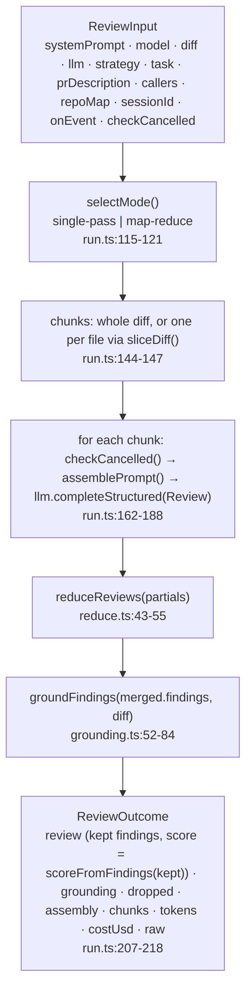

# reviewer-core — pipeline

Last verified: 2026-09-24 against c03665a

## Purpose

`@devdigest/reviewer-core` turns a parsed unified diff plus resolved agent
inputs into a grounded `Review`: it assembles the prompt, calls the injected
`LLMProvider` for structured output, merges partial reviews, drops findings
that do not cite a real diff line, and recomputes the score from what
survived. It has no database, filesystem, GitHub or HTTP access of its own —
the single side effect is the injected provider (`src/index.ts:2-11`). The
server calls `reviewPullRequest()` from
`../server/src/modules/reviews/run-executor.ts` and owns persistence, SSE,
cancellation semantics and cost books.

## Layout

| Path | Role |
|---|---|
| `src/index.ts` | Public barrel: `assemblePrompt`, `wrapUntrusted`, `groundFindings`, `groundingSummary`, `toJsonSchema`, `extractJson`, `parseWithRepair`, `reduceReviews`, `sliceDiff`, `reviewPullRequest` (+ defaults and types), `toReviewPayload`, `gateTriggered`, `countBlockers`, `OpenRouterProvider`. |
| `src/review/run.ts` | `reviewPullRequest(input)` — the engine entry point; strategy selection, chunk loop, reduce, grounding, score. |
| `src/prompt.ts` | `assemblePrompt(parts)` → `{ messages, assembly }`; `INJECTION_GUARD`; `wrapUntrusted(label, content)`; 4 000-char cap on the PR description. |
| `src/grounding.ts` | `buildLineIndex(diff)`, `groundFindings(findings, diff)`, `groundingSummary(result)`; the full-file exemption set. |
| `src/review/reduce.ts` | `scoreFromFindings` (severity penalties), `reduceReviews` (merge partials), `sliceDiff` (one file's slice of the raw diff). |
| `src/llm/structured.ts` | `toJsonSchema` (zod → JSON Schema through the OpenAI helper), `extractJson`, `parseWithRepair` (validate + reprompt text). |
| `src/llm/openrouter.ts` | `OpenRouterProvider`: the one OpenAI-compatible `completeStructured` implementation (strict `json_schema`, session id, usage cost, parse-with-repair loop) plus `listModels()` with pricing. |
| `src/output/to-review.ts` | `toReviewPayload(review, opts)` → GitHub review body / inline comments / event; `gateTriggered`, `countBlockers` over a `CiFailOn` policy. |
| `test/` | `run.test.ts` (engine end to end with the server's mocks), `prompt.test.ts` (guard + PR description), `to-review.test.ts` (gate, blockers, anchoring). |

Contracts (`Review`, `Finding`, `UnifiedDiff`, `LLMProvider`, `PromptAssembly`,
`CiFailOn`, …) are imported from `@devdigest/shared`, which `tsconfig.json`
and `vitest.config.ts` alias to `../server/src/vendor/shared` — the engine
declares no contract of its own.

## Data flow — one `reviewPullRequest()` call

1. **Mode.** `strategy` defaults to `auto`: map-reduce only when the diff is
   both larger than `mapThresholdLines` (default 400) and multi-file;
   `single-pass` always sends the whole diff in one call; `map-reduce` needs
   more than one file (`src/review/run.ts:29-30`, `:115-121`).
2. **Prompt.** Every chunk is assembled with the same parts; the system
   message is the agent prompt plus `INJECTION_GUARD`; the user message is the
   ordered sections task → PR description → skills → memory → repo skeleton →
   project context (specs) → callers → diff, each untrusted block wrapped in
   `<untrusted source="…">` with any closing tag escaped
   (`src/prompt.ts:85-127`, `:30-34`). The `assembly` kept for the trace is the
   single-pass call, or the whole-diff assembly in map-reduce
   (`src/review/run.ts:141-142`, `:173`).
3. **LLM.** `llm.completeStructured<Review>({ model, schema: Review,
   schemaName: 'Review', messages, maxRetries, sessionId? })`; tokens are
   summed, `costUsd` becomes null as soon as one chunk reports null, raw
   outputs are joined with `\n---\n` (`src/review/run.ts:174-187`, `:217`).
4. **Reduce.** One partial is returned as-is; several are merged: findings
   concatenated, worst verdict wins, mean score, summaries joined
   (`src/review/reduce.ts:43-55`).
5. **Ground and score.** `groundFindings` splits findings into kept/dropped;
   each drop is emitted as an `info` event with its reason, then the summary
   `"k/n passed"` as a `result` event; the returned review carries the kept
   findings and `scoreFromFindings(kept)` (`src/review/run.ts:196-208`).

Events: `info` (mode, drops), `tool` (per chunk, before the call), `result`
(candidates per chunk, reduced totals, grounding) — the server bridges them
to SSE, `test/run.test.ts:69` asserts the grounding line.

## Boundaries & dependencies

- **Pure.** No import may touch DB, fs, network or process state; the only
  runtime dependencies are `openai` (SDK + zod helper) and `zod`
  (`package.json`). Persistence, SSE, cancellation errors and price books are
  the caller's (`src/review/run.ts:19-23`, `:87-92`).
- **Provider-agnostic.** The engine only needs `LLMProvider.completeStructured`;
  `OpenRouterProvider` lives here because both the studio server and the CI
  runner need the same guarded implementation (`src/llm/openrouter.ts:12-23`);
  OpenAI / Anthropic providers live in `../server/src/adapters/llm/`.
- **Cost is injected.** `OpenRouterProvider` reports `usage.cost` when
  OpenRouter returns it, else calls the injected `estimateCost`, else null
  (`src/llm/openrouter.ts:96-107`).
- **Contracts are borrowed.** Any change to `Review` / `Finding` happens in
  `../server/src/vendor/shared/contracts/findings.ts` and is mirrored to the
  client; this package never defines a zod schema.
- **Source-only.** Nothing is emitted: `npm run build` is `tsc --noEmit`;
  consumers alias `@devdigest/reviewer-core` to `src/` (`package.json`,
  `src/index.ts:8-11`).

## Extension points

- **New prompt slot:** add the field to `PromptParts` and `ReviewInput`,
  render it in `assemblePrompt` (wrapped with `wrapUntrusted` when the content
  is not ours), and add it to `PromptAssembly` in the shared contract so the
  trace drawer can show it (`src/prompt.ts:39-73`, `:104-138`).
- **New grounding exemption:** extend `FULL_FILE_KINDS`
  (`src/grounding.ts:16`) and cover it in `../server/test/grounding.test.ts`.
- **New score weights:** `SEVERITY_PENALTY` (`src/review/reduce.ts:13-17`);
  `test/run.test.ts:72` pins "clean approve = 100" and
  `../server/test/reviews.it.test.ts` pins 65 for one CRITICAL.
- **New provider:** implement `LLMProvider.completeStructured` with
  `toJsonSchema` + `parseWithRepair` from `src/llm/structured.ts`; keep the
  reprompt loop shape of `OpenRouterProvider`.

## Open questions

- `skills`, `memory`, `specs` slots (`src/review/run.ts:55-60`) and the
  `toReviewPayload` CI output are exported but have no caller in the starter;
  they are reserved for later lessons. Unverified whether the CI runner still
  expects the current `ToReviewOptions` shape.
- `sliceDiff` matches a file header with `line.includes(\` ${path}\`)`
  (`src/review/reduce.ts:64`), which also matches paths that share a suffix;
  only reachable in map-reduce mode, which the studio does not use
  (`../server/src/modules/reviews/constants.ts:12`).
