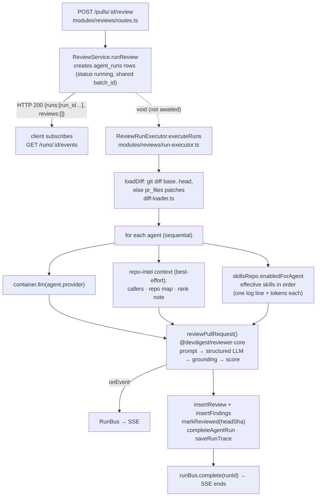

# server — architecture

Last verified: 2026-09-27 (L02 Stage 4b: skills in review runs)

## Purpose

`@devdigest/api` is the Fastify 5 backend of DevDigest: it imports repos and
pull requests from GitHub, indexes a clone with `repo-intel`, stores reviewer
agents, and runs reviews (diff → `@devdigest/reviewer-core` → grounded
findings) while streaming progress over SSE and persisting one trace document
per run. It owns all I/O (Postgres, git, GitHub, LLM providers, secrets) and
deliberately owns no review logic: prompt assembly, structured output,
grounding and scoring live in `../reviewer-core` and are called as a pure
function. There is no login: every request resolves to the single seeded
workspace (`src/adapters/auth/local.ts`).

## Layout

| Path | Role |
|---|---|
| `src/server.ts` | Process entry: `loadConfig()` → `buildApp()` → `listen`; SIGTERM/SIGINT run `app.close()` once. |
| `src/app.ts` | `buildApp()`: Fastify instance, zod validator/serializer, `Container`, stale-run reaping, plugins, `/health*`, error handler, module registration. Exported so tests use `app.inject()`. |
| `src/platform/config.ts` | The single env schema → `AppConfig`. Secrets are deliberately NOT here. |
| `src/platform/container.ts` | DI composition root: config, db, jobs, run bus, lazily built adapters, shared repositories, `ContainerOverrides` for tests. |
| `src/platform/errors.ts` | `AppError` taxonomy (`NotFoundError` 404, `ValidationError` 422, `ExternalServiceError` 502, `ConfigError` 500). |
| `src/platform/jobs.ts` | `JobRunner`: p-queue (concurrency 3, 120 s timeout, 2 retries) mirrored into the `jobs` table. |
| `src/platform/sse.ts` | `RunBus`: per-run in-memory event buffer + emitter; cancel flag; `runBus` singleton. |
| `src/platform/run-logger.ts` | `RunLogger`: one call publishes to the bus (1..n runs), and mirrors to pino. |
| `src/platform/price-book.ts` | `PriceBook`: live OpenRouter prices with the static `adapters/llm/pricing.ts` table as fallback; synchronous `estimate()`. |
| `src/platform/resilience.ts` | `withTimeout` / `withRetry` used by adapters, jobs and the indexer. |
| `src/platform/grounding.ts`, `prompt.ts`, `structured.ts` | Re-export shims over `@devdigest/reviewer-core` for older import paths. |
| `src/modules/index.ts` | Static module registry (9 plugins). |
| `src/modules/<name>/` | `routes.ts` (Fastify plugin + zod schemas) → `service.ts` → `repository.ts` (Drizzle). `workspace`, `settings` still query Drizzle from the route directly (the thin-module exception). `pulls` (service + repository) and `polling` (service only — it owns no table and writes through `container.pullsRepo` / `container.reposRepo`) are layered since the onion refactor, see `../specs/refactor-onion.md`. |
| `src/modules/_shared/` | `context.ts` (tenancy), `schemas.ts` (`IdParams`), `run-cost.ts`, `latest-batch.ts`, `diff-parser.ts` (`parseUnifiedDiff`, also used by the git adapter and its mock), `job-kinds.ts` (JobRunner kind strings that `repos` enqueues and `repo-intel` handles) — helpers two modules need without importing each other. |
| `src/modules/skills/` | Skills (L02): owns `skills`, `skill_versions` and `agent_skills`. `routes.ts` (`/skills*`, `/agents/:id/skills`, every route with `schema.response`) → `service.ts` (transactions) → `repository.ts`; `errors.ts` (`SkillErrorCode` errors), `helpers.ts` (pure: DTO mapping, version-bump / link-change rules), `types.ts` (the `SkillsPort` other modules reach via `container.skillsRepo`); `import/` is the pure import pipeline (base64 → in-memory zip via `fflate` → `SKILL.md` + YAML frontmatter via `yaml` → preview / save; no I/O, nothing written or executed). See `../specs/skills.md`. |
| `src/modules/repo-intel/` | Facade `RepoIntel` (`src/modules/repo-intel/types.ts`) + indexer pipeline; `extract.ts` is the pure regex extractor (endpoints, crons, fallback symbols/references), also used by the ripgrep `codeindex` adapter; see its `README.md`. |
| `src/adapters/` | Real implementations of the ports and `mocks.ts` fakes for tests: the interfaces in `src/vendor/shared/adapters.ts` (llm, github, git, codeindex, embedder, secrets, auth) and the repo-intel-only ports in `src/modules/repo-intel/types.ts` (`CodeParser` ← `astgrep`, `Tokenizer` ← `tokenizer`, `DepGraph` ← `depgraph`); the tokenizer is also read by the skills module (`Skill.body_tokens`) through `container.tokenizer`. Adapters implement ports; they do not declare them. |
| `src/db/` | `client.ts` (postgres-js + Drizzle), `schema.ts` barrel over `schema/*.ts` (13 domain files + `src/db/schema/_shared.ts`), `migrations/` (drizzle-kit output), `migrate.ts`, `seed.ts` (CLI entry detected by `isEntryPoint()` in `cli.ts`, Windows-safe), `rows.ts` (shared row types). |
| `src/vendor/shared/` | Master copy of `@devdigest/shared` (zod contracts + adapter interfaces), aliased via `tsconfig.json` `paths`. |
| `test/` | Vitest suites; `helpers/pg.ts` starts Postgres via testcontainers, `helpers/runs.ts` waits for background runs. |

## Boot sequence (`src/app.ts`)

1. `loadConfig()` parses env once (`src/platform/config.ts:64-81`); `createDb()`
   opens the postgres-js pool unless a `db` was injected.
2. Fastify is created with a 1 MB body limit and pino (pretty in development,
   off when `logLevel === 'silent'`); zod `validatorCompiler` +
   `serializerCompiler` are installed. The validator runs for every route
   schema; the serializer runs only for routes that declare
   `schema.response` — today the four `pulls` routes, `POST /repos/:id/poll`
   and every `skills` route do (`src/modules/pulls/routes.ts`,
   `src/modules/polling/routes.ts`, `src/modules/skills/routes.ts`); the rest go out through plain
   `JSON.stringify` (see "Architecture decisions").
3. `new Container(config, db, overrides)` is decorated as `app.container`.
4. **Before any plugin**, `ReviewService.reapStaleRuns()` is awaited: every
   `agent_runs.status = 'running'` row is set to `failed` (orphans of a dead
   process). Awaiting closes the race with a fresh `POST /review`.
5. `@fastify/helmet`, `@fastify/cors` (origin = `http://localhost:<WEB_PORT>`),
   `fastify-sse-v2`, then `@fastify/rate-limit` 120/min (skipped when
   `NODE_ENV=test`).
6. `/health` (liveness) and `/health/ready` (`select 1`, 503 when the DB is
   down) — both exempt from rate limiting.
7. The structured error handler is set, then every plugin in
   `src/modules/index.ts` is registered. Module plugins also register their
   job handlers at this point (`repos/routes.ts:24`; `repo-intel/routes.ts:29`
   on the container's single `container.repoIntelService`).
8. `onClose` closes the pool the app created.

Migrations never run here: `pnpm db:migrate` (`src/db/migrate.ts`) is a
separate step, also reused by `test/helpers/pg.ts`.

## Request flow

1. Fastify matches the route; `schema.params` / `schema.body` (zod) reject
   bad input with 422 before the handler runs. Most `/:id` routes use
   `IdParams` (uuid) from `src/modules/_shared/schemas.ts`.
2. The handler calls `getContext(container, req)`
   (`src/modules/_shared/context.ts`) → `AuthProvider.currentUser` /
   `currentWorkspace` → `{ workspaceId, userId }`. `LocalNoAuthProvider` returns the seeded
   `default` workspace and `you@local` user, so every query is workspace-scoped
   the same way.
3. The handler delegates to the module service (or queries Drizzle directly
   in the thin modules) and returns a plain object. Without a
   `schema.response` Fastify sends it with plain `JSON.stringify` — nothing
   filters extra fields. With one, the zod serializer
   (`fastify-type-provider-zod` 4.x) runs `schema.safeParse(data)` and sends
   `result.data`: keys outside the schema are dropped (unless the schema uses
   `.passthrough()`, e.g. `Settings`) and a mismatch becomes a 500.
4. Errors reach the handler in `src/app.ts:116-164`: type-provider validation →
   422 `validation_error`; response-serialization failure → 500 without the
   payload; any `ZodError` (matched by shape, not `instanceof`, because two zod
   instances exist) → 422; `AppError` → its `statusCode` and `code`; anything
   else → `statusCode ?? 500` `internal_error`. Body shape is always
   `{ error: { code, message, details? } }` (`ApiErrorBody`).

## Data flow — one review run

Every log line goes through `RunLogger` (`src/platform/run-logger.ts`), which
publishes to the bus **and** pino. Pre-work (diff load) uses a logger fanned
out over all run ids of the batch, so each run's buffer — and therefore its
persisted trace `log` — contains the shared steps. The trace is written as one
jsonb document in `run_traces` (PK = `agent_runs.id`).

## DI container (`src/platform/container.ts`)

| Member | Built from | Override key |
|---|---|---|
| `config`, `db` | constructor args | — (`buildApp({ config, db })`) |
| `secrets` | `LocalSecretsProvider(config.secretsPath)` — `~/.devdigest/secrets.json`, env fallback | `secrets` |
| `auth` | `LocalNoAuthProvider(db)` | `auth` |
| `jobs` | `new JobRunner(db)` | — |
| `runBus` | module singleton `runBus` | — |
| `git` | `SimpleGitClient(config.cloneDir)` | `git` |
| `github()` | `OctokitGitHubClient(GITHUB_TOKEN)`; `ConfigError` when unset | `github` |
| `llm(id)` | `OpenAIProvider` / `AnthropicProvider` / `OpenRouterProvider` (from reviewer-core, wired to `priceBook`); cached per id; `ConfigError` when the key is unset | `llm: { openai?, anthropic?, openrouter? }` |
| `embedder()` | `OpenAIEmbedder` over `llm('openai')`; throws unless `EMBEDDINGS_ENABLED=true` | `embedder` |
| `codeIndex` | `RipgrepCodeIndex(git)` | `codeIndex` |
| `repoIntelService` | the one `RepoIntelService(this)` (takes `RepoIntelDeps`, a `Pick<Container>` of repoIntelRepo, config, git, jobs, codeIndex, depgraph, tokenizer, codeParser); the repo-intel plugin registers its job handlers on it | — |
| `repoIntel` | the `RepoIntel` facade: the override if given, else `repoIntelService` (job handlers stay on `repoIntelService` either way) | `repoIntel` |
| `depgraph`, `tokenizer` | `DepCruiseGraph`, `TiktokenTokenizer` (repo-intel indexer; skills `body_tokens`) | `depgraph`, `tokenizer` |
| `codeParser` | `AstGrepCodeParser` (`@ast-grep/napi`), the `CodeParser` port of repo-intel — facade and indexer pipelines; fake: `MockCodeParser` | `codeParser` |
| `priceBook` | `PriceBook(openrouter /models lister, estimateCost)` | — |
| `agentsRepo`, `reviewRepo` | shared repositories for cross-module reads (`reviewRepo` is the one `ReviewRepository`: `ReviewService` uses it, and it feeds the PR-list aggregates of `PullsService`; `agentsRepo` gives `ReviewService` its targets as the `Agent` contract via `listEnabledAgents` / `getAgent`; it is built with `skillsRepo` for `Agent.skill_count` and version snapshots) | — |
| `skillsRepo`, `skillsModuleRepo` | one `SkillsRepository`, exposed twice: `skillsRepo` typed as the cross-module `SkillsPort` (`effectiveSkillCounts`, `snapshotLinks`, `enabledForAgent`, `namesInWorkspace`; `src/modules/skills/types.ts:69`), `skillsModuleRepo` as the full repository for the skills routes only (`src/platform/container.ts:118-128`) | — |
| `pullsRepo`, `reposRepo` | `PullsRepository` (owner of `pull_requests`, `pr_files`, `pr_commits`) and `RepoRepository` (owner of `repos`; other modules use `getRef`) | — |
| `repoIntelRepo` | `RepoIntelRepository` (repo-intel's index tables), built here and handed to `RepoIntelService` | — |

Services built from the container take only the members they read
(`Pick<Container, …>`, onion R5): `PullsService`, `PollingService`,
`ReviewService` (`ReviewDeps`; its `ReviewRunExecutor` takes `ReviewRunDeps`
and `loadDiff` only `git`), `RepoIntelService` (`RepoIntelDeps`) and the
indexer pipelines (`IndexPipelineDeps`, `src/modules/repo-intel/pipeline/full.ts`).
`AgentsService` and `RepoService` still take the whole `Container`.

`invalidateSecretCaches()` drops the llm/github/embedder caches after
`POST /settings/test-connection` stores a new key.

## Background work

`JobRunner.enqueue(workspaceId, kind, payload)` inserts a `jobs` row and runs
the registered handler under `withTimeout` + `withRetry`, updating
`status` / `attempts` / `error`. Handlers are registered by route plugins at boot:

| Kind | Enqueued by | Handler registered in |
|---|---|---|
| `clone` | `repos/service.ts` `add()` / `refresh()` | `repos/routes.ts:24` → `RepoService.registerCloneJobHandler` |
| `repo-intel-index` | `repos/service.ts` after a clone completes | `repo-intel/routes.ts:29` → `container.repoIntelService.registerIndexJobHandlers` |
| `repo-intel-refresh` | `repos/service.ts` `refresh()` | same |
| `repo-intel-resync` | `POST /repos/:id/resync` | same |

Review runs are **not** jobs: `ReviewService.runReview` starts
`executeRuns()` as an un-awaited promise in the request process
(`src/modules/reviews/service.ts:157`). One API instance per database is
assumed (the boot reaper would misfire with replicas).

## Boundaries & dependencies

- **Modules never import another module's folder.** Cross-module data goes
  through `container.agentsRepo` / `container.reviewRepo` /
  `container.repoIntel` or a helper in `src/modules/_shared/` (e.g. `pulls`
  uses `_shared/latest-batch.ts` instead of `modules/reviews`). Checked by
  the advisory `pnpm deps:check` (dependency-cruiser,
  `.dependency-cruiser.cjs`, all rules `warn`), not enforced. It runs with
  `--ignore-known`, so it prints only violations absent from
  `.dependency-cruiser-known-violations.json` (rewritten by
  `pnpm deps:baseline` after a known violation is fixed). The layer rules
  it reports on are in `.claude/skills/onion-architecture/SKILL.md`.
- **Services never construct I/O.** Adapters implement the interfaces in
  `src/vendor/shared/adapters.ts`; tests replace them with
  `src/adapters/mocks.ts` via `buildApp({ overrides })`.
- **Secrets.** `LocalSecretsProvider` (`src/adapters/secrets/local.ts`) is
  the only reader of `process.env` for keys; `config.ts` excludes them. Stored
  file values beat env; `GITHUB_PAT` is accepted as a fallback for
  `GITHUB_TOKEN`.
- **Engine boundary.** `@devdigest/reviewer-core` resolves to
  `../reviewer-core/src` through `tsconfig.json` `paths` and the alias in
  `vitest.config.ts` (no npm link). The server passes `{ systemPrompt, model,
  diff, llm, strategy, callers?, repoMap?, prDescription?, task, sessionId,
  onEvent, checkCancelled }` and receives grounded findings, the recomputed
  score, token/cost totals and the prompt assembly. The score the model
  reports is never persisted.
- **Contracts.** `src/vendor/shared` is the master copy of
  `@devdigest/shared`; edits must be mirrored to
  `../client/src/vendor/shared` (see `AGENTS.md` for the files that already
  drifted).
- **Database.** Only repositories and the thin route modules touch Drizzle.
- **Transactions.** A use case that writes several tables atomically owns
  `db.transaction` in its service; the repository functions take a `DbOrTx`
  executor (`src/db/client.ts`). Today: the PR-detail sync in
  `PullsService.getDetail` (`src/modules/pulls/service.ts`) and the PR-list
  poll in `PollingService.poll` (`src/modules/polling/service.ts`: every upsert
  plus `last_polled_at`, after the GitHub fetch), and the skills writes in
  `SkillsService` (`src/modules/skills/service.ts`): create = skill + v1 body
  snapshot; update = row lock, ack rule, version bump + snapshot; link save =
  agent row lock, link replacement and at most one agent version bump. The
  link save is a **cross-module transaction**: the skills service opens it and
  calls the agents repository's `lockVersion` / `bumpVersion`
  (`src/modules/agents/repository.ts:170`, `:184`), which take the `DbOrTx`
  from `container.agentsRepo`; neither module imports the other (the agents
  side declares its own narrow `AgentSkillLinks` interface,
  `src/modules/agents/types.ts:9`).
  Schema edits go `src/db/schema/*` → `pnpm db:generate` → `pnpm db:migrate`;
  migration files are never edited.
- **Tenancy.** `workspace_id` scoping is done per query using the id from
  `getContext`; there is no base-repository guard.

## Extension points

- **Route in an existing module:** add it to `modules/<name>/routes.ts` with a
  zod `schema` (use `IdParams` for uuid ids) and call `getContext` first.
- **New module:** `modules/<name>/routes.ts` exporting a default
  `FastifyPluginAsync`, plus one import + one entry in `modules/index.ts`.
  Register job handlers inside the plugin if the module owns any.
- **New adapter:** port interface in the consuming module's `types.ts` when
  one module uses it, otherwise in `src/vendor/shared/adapters.ts` (mirror to
  client); implementation under `src/adapters/<kind>/`, a getter and an
  `ContainerOverrides` key in `container.ts`, a fake in `adapters/mocks.ts`.
- **New job kind:** a `<MODULE>_JOB_KIND` constant (in
  `src/modules/_shared/job-kinds.ts` when another module enqueues it),
  `container.jobs.register` in the module's route plugin,
  `container.jobs.enqueue` at the call site.
- **New env var:** extend `EnvSchema` and `AppConfig` in
  `src/platform/config.ts`; feature code reads `container.config` only.
- **New table / column:** edit `src/db/schema/<domain>.ts`, generate and
  apply a migration, add row types to `src/db/rows.ts` if other modules need
  them.

## Architecture decisions

Dated log of the `onion-architecture` skill's triggers that fired and what
was decided. A deferred trigger is not proposed again until its "revisit
when" condition appears.

- 2026-09-26 — Trigger "thin module → layered" fired for `pulls` and
  `polling`: both query Drizzle from routes and write tables owned by other
  modules. `pulls/routes.ts` (393 lines) syncs PR detail from GitHub and
  reads the reviews module's tables (`src/modules/pulls/routes.ts:126-180`);
  `polling/routes.ts` inserts `pull_requests` (`src/modules/polling/routes.ts:33`)
  and updates `repos` (`:61`). Decision: refactor deferred by the user; the
  thin-module exception (own tables + read-only access to others) covers
  only `settings` and `workspace`. New routes in `pulls`/`polling` go through
  a service. Revisit when either module gains a new write path or its logic
  is needed outside HTTP.
- 2026-09-26 — Risk recorded with the entry above: the `pulls` detail sync
  replaces `pr_files` and `pr_commits` by delete → insert and then updates
  `pull_requests` as five independent statements without a transaction
  (`src/modules/pulls/routes.ts:251-285`). A failure between them leaves a PR
  with no files or commits until the next successful sync. It is the first
  candidate for the "transaction for a use case" trigger (use-case
  `db.transaction` + `Db | Tx` executor); not scheduled.
- 2026-09-26 — Response serialization: 0 of 37 routes declare
  `schema.response`, so the zod serializer never runs. Decision: required for
  new and changed routes together with a response-shape test; no bulk sweep.
- 2026-09-27 — The two deferrals above are lifted: the user decided to
  execute the "thin module → layered" trigger for `pulls` and `polling` and
  the "transaction for a use case" trigger for the `pulls` detail sync now.
  Work runs on branch `lesson-2` per `../specs/refactor-onion.md` (stages T,
  a, b, b′, c, d, e), which also clears most of the dependency-cruiser
  baseline. Also recorded, not fixed: the reviews module writes
  `pull_requests` (`src/modules/reviews/repository/pull.repo.ts:40`
  `markReviewed`) and reads `pr_files`/`repos` — a table-ownership leak.
- 2026-09-27 — Done: the onion refactor of `../specs/refactor-onion.md`
  (stages T, a, b, b′, c, d, e) is complete on `lesson-2`. `pulls` and
  `polling` are layered; the `pulls` detail sync and the `polling` upserts run
  in one `db.transaction` each (`Db | Tx` executors in `PullsRepository` /
  `RepoRepository`); the reviews service and executor see no Drizzle rows;
  pure helpers moved inward (`src/modules/_shared/{diff-parser,job-kinds}.ts`,
  `src/modules/repo-intel/extract.ts`); repo-intel owns its ports
  `CodeParser` / `Tokenizer` / `DepGraph` (`src/modules/repo-intel/types.ts`);
  one `RepoIntelService` per container (`container.repoIntelService`), and
  `RepoIntelService`, the index pipelines and `ReviewService` take
  `Pick<Container, …>`. The dependency-cruiser baseline went from 18 entries
  to 1 (`src/modules/repos/helpers.ts`, out of scope). Still recorded, not
  fixed: the reviews → `pull_requests` ownership leak
  (`src/modules/reviews/repository/pull.repo.ts` `markReviewed`, entry
  above). Next transaction candidate, not decided: the executor's five
  writes after a run and their done → trace order
  (`src/modules/reviews/run-executor.ts`). Revisit the leak when a second
  module needs to change `last_reviewed_sha`.
- 2026-09-27 — `agent_runs.cost_usd` stays `double precision`
  (`src/db/schema/runs.ts:22`, migration
  `src/db/migrations/0010_chubby_psylocke.sql:1`), although
  `postgresql-table-design` asks for `NUMERIC` for money (pr-self-review
  WARNING on `runs.ts:22`). The value is an estimate of LLM spend for display
  (token counts × PriceBook prices, summed per PR in
  `src/modules/_shared/run-cost.ts`), not an accounting record; float
  rounding at that scale does not change what the UI shows. Moving to
  `NUMERIC` needs a separate decision and a new migration (0010 is applied
  and never edited), plus string ↔ number mapping in the repositories.
  Revisit when costs are billed, reconciled or exported for accounting.

## Open questions

- `src/platform/model-router.ts`, `src/platform/trace-builder.ts`,
  `src/platform/prompts.ts` and `src/prompts/onboarding.system.md` have no
  importers under `src/` (grep); they appear to be pre-provisioned for later
  lessons. Unverified whether anything outside this package relies on them.
- `ReviewRepository.upsertIntent` / `getIntent` (`pr_intent`) have no callers
  in the review path; the executor comments mention "intent" but no intent is
  derived. Unverified whether a later lesson wires it.
