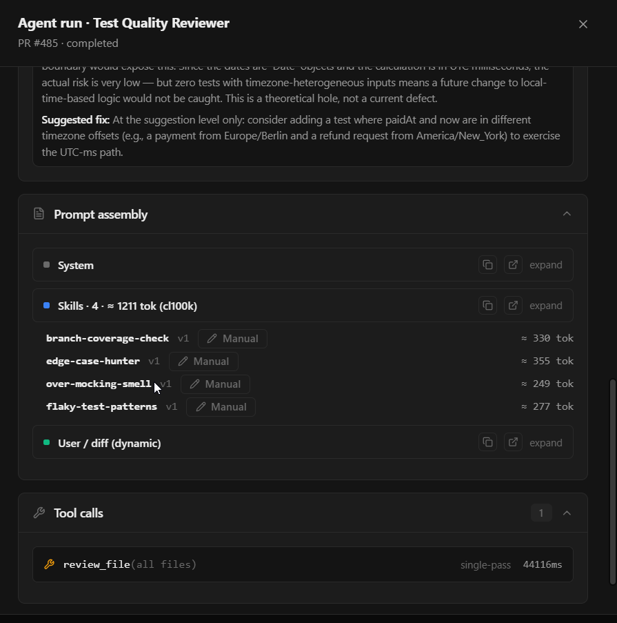
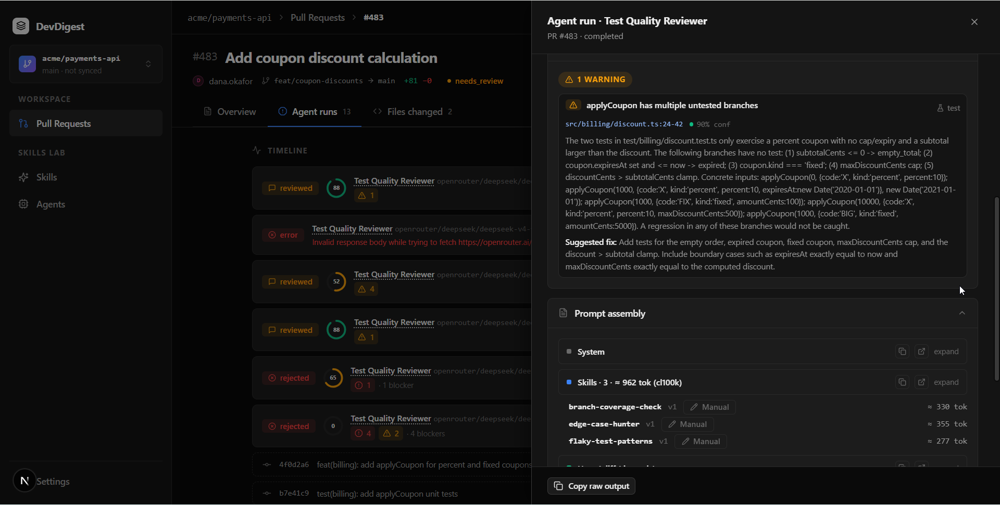

Status: draft

# HW02 — Conventions Extractor and API Contract Reviewer

Homework 2 of the course. The pass mark is **all 53 acceptance criteria**. It
closes the lab gaps that are left against criteria #1–37, builds an API
Contract Reviewer and runs the control experiments, then builds the
Conventions Extractor. The Conventions Extractor turns code-style conventions
found in a repository into one skill, `repo-conventions`.

**Sources** — every requirement below cites one of them:
- `#N` — an acceptance criterion in [HW02-brief.md](HW02-brief.md) →
  "Acceptance criteria" (1–53).
- A brief line ID (the brief text is kept verbatim in the same file; the IDs
  exist only here):
  - **U1–U7** — "Як юзер я можу": run the analysis; see all conventions;
    accept / reject; edit one; open the skill modal from the chosen ones; edit
    the future skill text and metadata; save or cancel.
  - **R1–R7** — "Можлива реалізація": table + route; code-only sampling; a
    cheap model call; code check of the evidence; candidate list UI with
    approve / reject; approved → one `repo-conventions` skill linked to an
    agent; many skills (optional).
  - **P1–P4** — "План дій": the agent created through the UI, with its prompt
    and skill prompts; 3–4 skills, each with a directive description and a
    good / bad example; linked in the Skills tab, at least one imported; the
    experiment without vs with skills.
  - **K1–K7** — the brief's "Критерії приймання": demo video; an open PR with
    a good description; extractor results in the UI; 1+ skills from accepted
    candidates, rejected ones excluded; evidence from real code with a click
    to the file on GitHub; the generated skill links to an agent and runs in a
    review; the API reviewer with skills catches what it missed without.
  - **X1a / X1b / X2 / X3** — "Додаткове завдання": skill import from a URL;
    packaging a skill as a Claude Code plugin; running the extractor on your
    own work repository; better or more findings.
  - **DZ** — the designs `…\Screenshots\2026-09\1.png` (Conventions page) and
    `2.png` (the "Create skill from conventions" modal).
- **D-n** — a design decision of ours, labelled as such. A D-decision never
  adds an agent, a screen, a feature or an experiment. Anything that would
  needs the user's explicit yes and is listed under "Out of scope" until then.

Course integrity: work only from the starter, our own commits and the working
tree (root `AGENTS.md` → "Course integrity (hard rule)").

## Traceability — acceptance criteria

Status at spec time: ✅ present · ⚠ partial · ❌ missing. Evidence was checked
in the working tree on 2026-09-29.

| # | Criterion (short) | Status · evidence | Stage | Verified by |
|---|---|---|---|---|
| 1 | Root `AGENTS.md`; `CLAUDE.md` = symlink or one-line `@AGENTS.md` | ❌ `CLAUDE.md` is a plain file; no `AGENTS.md` | 0a | file check: `CLAUDE.md` is exactly `@AGENTS.md` |
| 2 | Same in `server/`, `client/`, `reviewer-core/` | ❌ plain `CLAUDE.md` in each (and `e2e/`) | 0a | file check in 4 packages; grep for stale references |
| 3 | UI-architecture skill: pages, page components, shared components, naming, tests | ✅ `.claude/skills/frontend-architecture/SKILL.md:32-36`, `:45-46`, `:92-103` | — | final walk |
| 4 | Onion skill: route→service→domain via the container, adapters at the edge, dependencies inward, **no adapter call from a route** | ⚠ the ban is only a ✗ cell of the import matrix (`.claude/skills/onion-architecture/SKILL.md:49`), not a rule in prose; the same row allows "via `app.container`" | 0b | the rule stated in prose, the loophole closed |
| 5 | `pr-self-review` is a Workflow (skill dispatcher) | ❌ neither word appears (`.claude/skills/pr-self-review/SKILL.md:1-8`, `.claude/skills/README.md:22`) | 0b | frontmatter + description + catalog row |
| 6 | Agents in SKILLS LAB | ✅ `client/src/vendor/ui/nav.ts:32` | — | final walk |
| 7 | Agents page: card grid | ✅ `client/src/app/agents/_components/AgentsListView/AgentsListView.tsx:83-94` | — | final walk |
| 8 | `/skills` CRUD reads/writes Postgres | ✅ `server/src/modules/skills/routes.ts:42-100`, `repository.ts:57-167` | Final | live: POST → SQL select; SQL delete → GET no longer lists it |
| 9 | Skill cards: name, type, description, enabled toggle | ✅ `client/src/app/skills/_components/SkillsListView/_components/SkillCard/SkillCard.tsx:31-40` | — | final walk |
| 10 | Card click → preview in a side panel | ⚠ master-detail exists (`SkillsListView/styles.ts:7`, `:38`) but a click opens Config (`client/src/app/skills/[id]/page.tsx:18`) | 0c | D4; client test |
| 11 | "Add" → create or import; create in a modal | ✅ `SkillsListView.tsx:51-63`, `CreateSkillModal.tsx:35` | — | final walk |
| 12 | Create form: name, description, type, markdown body | ✅ `SkillMetaFields.tsx:24-42`, `CreateSkillModal.tsx:59` | — | final walk |
| 13 | Agent Skills tab: link, enable, drag & drop | ✅ `…/AgentEditor/_components/SkillsTab/SkillsTab.tsx:107-132`, `…/SkillRow/SkillRow.tsx:39-55` | — | final walk |
| 14 | Drag order = order of skill blocks in the prompt | ✅ `SkillsTab.tsx:76` → `server/src/modules/skills/helpers.ts:48` → `repository.ts:235-254` → `reviewer-core/src/prompt.ts:78-81`, `:160` | Final | live: reorder → run → trace blocks swapped |
| 15 | Import `.md` / `.zip` with a preview | ✅ `ImportSkillModal.tsx:36-63`, `server/src/modules/skills/routes.ts:57-74` | — | final walk |
| 16 | ≥ 1 skill of the new agents is "imported" | ✅ since 2026-09-30: all four API skills imported as `.zip` (`imported_file` in the traces; was ❌, every seed skill `manual`) | 1c | one of the four API skills imported as `.zip` |
| 17 | Test Quality experiment: no skill → no flag; skill linked → flags the uncovered branch and the boundary | ✅ reproduced 2026-09-30 on #485 C: without skills 1/2 (strict 0/2), with skills 2/2 strict ("Stage 1c results"; caveat: unstable baseline, n = 2; was ⚠, #483's baseline caught its defect 2/2) | 1b–1d | PR #485, D12 protocol |
| 18 | API Contract experiment: no skill → miss; skill → catches the breaking change | ✅ reproduced 2026-09-30 on #486 A: 0/2 without, 2/2 with skills ("Stage 1c results"; was ⚠, #484's baseline caught it) | 1b–1d | PR #486, D12 protocol |
| 19 | Trace: separate skills block + tokens of that block only | ✅ `…/RunTraceDrawer/_components/TraceBody/TraceBody.tsx:79-88`, `server/src/modules/reviews/run-executor.ts:367` · evidence: run 58257669 (#485), `specs/assets/hw02-19-trace-skills.png` ("Stage 1c results" → Trace evidence) | 1c | trace screenshot in the results |
| 20 | Enabled skill = block; disabled = absent | ✅ `server/src/modules/skills/repository.ts:246-251` · evidence: run 35178148 (#483, `over-mocking-smell` off → Skills · 3 · ≈ 962 tok), `specs/assets/hw02-20-disabled-skill.png` | 1c | a run with one skill disabled |
| 21 | Manual `pr-self-review` on a client+server diff; no auto hook | ✅ static: `SKILL.md:5`, `:15`; `self-review.mjs:165-177` | Final | the user runs `/pr-self-review` |
| 22 | Skill card: current version + agent count | ⚠ agent count only (`SkillCard.tsx:40`) | 0c | `v{version}` chip; client test |
| 23 | Delete button on the skill card | ❌ only in Config (`…/ConfigTab/ConfigTab.tsx:82-84`) | 0c | client test |
| 24 | Delete confirm modal (confirm / cancel / X) | ⚠ `DeleteSkillConfirm.tsx` (kit `Modal` with X) is reachable only from Config | 0c | the same modal from the card; client test |
| 25 | Tabs Config, Preview, **Versioning** | ⚠ the label is "Versions" (`client/messages/en/skills.json:118-122`) | 0c | D4 |
| 26 | Preview renders markdown | ✅ `…/PreviewTab/PreviewTab.tsx:28-30` | — | final walk |
| 27 | Versioning lists every version | ✅ `…/VersionsTab/VersionsTab.tsx:25-43` | — | final walk |
| 28 | Diff of each older version against the current one | ❌ | 0c | D5; unit tests of the diff helper |
| 29 | Restore brings back an older body | ❌ (was out of scope in L02 D14) | 0c | D5; client test |
| 30 | Search in the agent Skills tab | ✅ `SkillsTab.tsx:94-103` | — | final walk |
| 31 | Only enabled skills can be dragged | ❌ `SkillRow.tsx:41` `draggable={linked}` | 0d | D6; client test |
| 32 | Agent card: name, description, model, toggle, skill counter | ✅ `client/src/app/agents/_components/AgentCard/AgentCard.tsx:35-70` | — | final walk |
| 33 | Delete button on the agent card (deletes from the DB) | ✅ `AgentCard.tsx:44` → `server/src/modules/agents/repository.ts:92-95` | — | final walk |
| 34 | Agent delete confirm modal | ❌ `window.confirm` (`AgentCard.tsx:44`), text not in i18n | 0d | D7; client test |
| 35 | Exactly 2 agent tabs: Config, Skills | ✅ `…/AgentEditor/constants.ts:11-14` | — | final walk |
| 36 | Agent Config: name, description, provider, model (from a list), strategy, system prompt | ✅ `…/AgentEditor/_components/ConfigTab/ConfigTab.tsx:87-132` | — | final walk |
| 37 | Agent Skills tab: all skills, a toggle, a type label | ⚠ all skills + label (`SkillsTab/helpers.ts:55-69`), but a checkbox, not a toggle (`SkillRow.tsx:65`) | 0d | D6; client test |
| 38 | `POST /repos/:id/conventions/extract` runs the analysis; results persist | ⚠ server side done 2026-10-01 (2b): `server/src/modules/conventions/routes.ts:34`, `service.ts:81`; `server/test/conventions.it.test.ts:273` (new app on the same DB → GET returns the scan); UI in 2c | 2a–2b | D14; `.it`: extract → wait → new app → GET returns it |
| 39 | Sampling in code only: eslint / tsconfig / prettier configs + top-12 `repoIntel.getConventionSamples()` | ✅ 2026-10-01 (2b): `server/src/modules/conventions/service.ts:167` (`readSamples`), `helpers.ts:30` (`isRootConfigFile`); `server/test/conventions-helpers.test.ts:26`, `conventions.it.test.ts:195` (409s with zero LLM calls), `:214` (numbered samples in the one call) | 2b | D15; unit + `.it` (no LLM call before sampling ends) |
| 40 | LLM answer `{category, rule, evidence: file+line, confidence}` | ✅ 2026-10-01 (2b): `ConventionExtraction` (`server/src/modules/conventions/types.ts:27`); `server/test/conventions-helpers.test.ts:180`, `conventions.it.test.ts:214` | 2b | D16; zod schema; `.it` with `MockLLMProvider` |
| 41 | Create modal edits the body and metadata | ❌ | 2c | client test |
| 42 | Approved → ONE skill `repo-conventions`, linked to an agent | ⚠ server side done 2026-10-01 (2b): `server/src/modules/conventions/service.ts:231` (`saveSkill`); `server/test/conventions.it.test.ts:345` (201, then 200 v2, one link, one skill); modal in 2c | 2b–2c | D18; `.it` |
| 43 | Four API skills with a directive description and a good / bad example | ❌ | 1a | files + Skills page |
| 44 | Conventions in SKILLS LAB | ❌ (`activeKeyFor` already maps `/conventions`: `client/src/components/app-shell/helpers.ts:31`) | 2c | client test |
| 45 | Run Scan and ReScan buttons | ❌ | 2c | D19; client test; Run Scan manual (D20) |
| 46 | Cards: rule, source file, confidence % | ❌ | 2c | client test; e2e |
| 47 | Accept / Reject / Edit on each card | ❌ | 2c | client test; e2e |
| 48 | Reject persists; never returns, never enters the skill | ⚠ server side done 2026-10-01 (2b): `server/src/modules/conventions/repository.ts:205` (`decisionsByRule`), `service.ts:126`; `server/test/conventions.it.test.ts:302` (re-scan keeps the rejection), `:345` (400 for a non-accepted id); UI + e2e reload in 2c / 2d | 2b–2c | `.it`; e2e reload |
| 49 | Inline edit | ❌ | 2c | client test |
| 50 | Create skill appears after ≥ 1 accept | ❌ | 2c | client test |
| 51 | Modal says it is created from conventions; Name / Description; Cancel / Create | ❌ | 2c | client test (DZ 2.png) |
| 52 | The new skill is listed on `/skills` | ❌ | 2d | e2e |
| 53 | Settings → Models: a conventions row, searchable dropdown, dynamic model | ✅ 2026-10-01 (2b): the extractor resolves `'conventions'` per run through `container.featureModels` (`server/src/platform/container.ts:162` → `resolveFeatureModel`; `server/src/modules/conventions/service.ts:110`); `server/test/conventions.it.test.ts:214` runs on the model chosen via `PUT /settings`. The 0e client fix (`SettingsModels.tsx`) saves the model's own provider | 0e + 2b | D8; the extractor resolves its model per run |

## Traceability — brief lines

| ID | Stage | Covered by |
|---|---|---|
| U1–U7 | 2 | #38, #45, #46–49, #41, #51 |
| R1 | 2 | #38 |
| R2 | 2 | #39 |
| R3 | 2 | #40, #53 |
| R4 | 2 | D16 (file and quoted code checked; unproven candidates dropped) |
| R5 | 2 | #47 |
| R6 | 2 | #42, D18 |
| R7 | — | **out of scope** ("як варіант"; the agreed scope is one `repo-conventions`) |
| P1 | 1 | D10: the user creates the agent in the UI with the prompt below |
| P2 | 1 | #43, D11 |
| P3 | 1 | #13, #16 |
| P4 | 1 | #18, D12 |
| K1 | Final | the user films it |
| K2 | Final | the user opens the PR after `/pr-self-review` |
| K3 | 2 | e2e + the demo |
| K4 | 2 | one skill is enough ("1 скіл чи декілька"); #42, #48 |
| K5 | 2 | D19: `path:line` → `githubBlobUrl` (`client/src/lib/github-urls.ts:24-36`) at the scan's head sha |
| K6 | 2 | link in the modal → a review run → a `repo-conventions` block in the trace |
| K7 | 1 | #18 |
| X1a | 3 | D21 |
| X1b | — | **out of scope** (the agreed Stage 3 has two items only) |
| X2 | 3 | D22 |
| X3 | 3 | a "product ideas" note only, no code |
| DZ | 2 | 1.png and 2.png; the differences are listed under Deviations |

## Decisions

### Stage 0 — lab gaps

- **D1 AGENTS.md (#1, #2)** — `git mv` each `CLAUDE.md` (root, `server/`,
  `client/`, `reviewer-core/`, `e2e/`) to `AGENTS.md`. The new `CLAUDE.md`
  holds one line, `@AGENTS.md`. It is an import, not a symlink: symlinks are
  unreliable on Windows checkouts.
- **D2 Reference updates** — the skills, docs, specs, READMEs and the
  course-integrity hook point to `AGENTS.md` for rule text. Two kinds of file
  keep their `CLAUDE.md` references:
  - `INSIGHTS.md` files, which are append-only;
  - `demo/L01/*`, the inputs of a video that is already filmed;
  - history inside the skills: Changelog entries in their `README.md`, and
    the research and plan notes in `references/` (`research.md`,
    `plan.md`);
  - `specs/HW02-brief.md` (verbatim), this spec's description of the
    rename, and the list of files that L02 touched
    (`specs/L02-skills.md` → "Docs and specs to update").
- **D3 Skill versions** — each bump follows that skill's README.
  - In Stage 0a, every versioned skill whose `SKILL.md` gets a pointer update
    (`CLAUDE.md` → `AGENTS.md`) gets a **patch** bump ("pointers").
  - In 0b, `onion-architecture` gets a rule in prose and loses a loophole: a
    route calls only its own module's service and never an adapter, directly
    or via `app.container`. A new rule is **minor**, landing on 1.2.0
    (`.claude/skills/onion-architecture/README.md:50-53`). Because of the
    minor bump, the final `/pr-self-review` re-checks the whole server.
  - In 0b, `pr-self-review` gets the Workflow label: `metadata.type:
    workflow`, a description that starts "Workflow (skill dispatcher)", and
    the catalog row in `.claude/skills/README.md`. That is wording, so another
    **patch** (`.claude/skills/pr-self-review/README.md:89-93`).
- **D4 Skill page (#10, #25)**
  - A card click opens `/skills/:id?tab=preview` from `/skills`. Inside
    `/skills/:id` it keeps the open tab. A bare `/skills/:id` defaults to
    Preview.
  - The tab label becomes "Versioning". The i18n key and the URL value stay
    `versions`.
- **D5 Diff and Restore (#28, #29)**
  - Diff: every older version gets a "Diff" button. It renders a line diff
    against the current body, computed by our own small LCS helper in the
    client with unit tests. There is no new dependency, so no lock-file
    change.
  - Restore sends `PUT /skills/:id { body }`. The route exists and already
    bumps the version and snapshots the body
    (`server/src/modules/skills/service.ts:130-142`). So a restore is a new
    version that carries the old body, and history is never rewritten.
- **D6 Agent Skills tab (#31, #37)**
  - A row is draggable, and a drop target, only while its link is enabled
    and the skill is enabled.
  - ↑/↓ follow the same rule (the user's decision): arrows appear only on
    movable rows (`isMovable`) and remain the keyboard way to reorder them.
    An arrow moves the row one step past its neighbour, whatever the
    neighbour's state.
  - `dragend` clears the dragged row, so a drag dropped on a disabled row
    cannot leak into the next drop.
  - The per-agent enable becomes the kit `Toggle` instead of a checkbox. The
    kit `Toggle` gains an optional `label` (its accessible name).
- **D7 Confirm modals (#23, #24, #34)**
  - The skill card reuses `DeleteSkillConfirm`.
  - Agent delete gets the same kit-`Modal` confirm (confirm / cancel / X)
    with i18n text.
- **D8 Feature model (#53)**
  - Settings saves the provider that the chosen model belongs to, not a
    hard-coded `"openrouter"`.
  - The extractor resolves its model on every run with
    `resolveFeatureModel(container, workspaceId, 'conventions')`
    (`server/src/modules/settings/feature-models.ts:51-57`).
- **D9 The lab's API Contract Reviewer is removed from the seed**
  - The agent and its seed skills `route-signature-diff` and
    `breaking-change-rubric` were homework scope that leaked into the lab.
  - PR fixtures #483 / #484 and the L02 Stage 8 record stay.
  - `docs/agent-prompts/api-contract-reviewer.md` is rewritten with the D10
    prompt.
  - Removing seed data does not touch an existing DB, so the user deletes the
    old rows through the UI (Stage 1c checklist).

### Stage 1 — API Contract Reviewer and the experiments

- **D10 Agent prompt (P1)**
  - The agent is created through the UI by the user (P1), not seeded.
  - Its system prompt (below) is deliberately **generic**: role, review
    discipline, severity and verdict rules. The contract know-how lives in the
    four skills. That is the brief's split between agent and skill prompts,
    and it gives the skills something to add.
  - The prompt is frozen with this spec: it is never tuned during
    calibration or the runs.
  - Only the Role paragraph is agent-specific. It follows the General
    Reviewer's role (`server/src/db/seed-prompts.ts:12-16`), including "Judge
    the code on its merits, not on what the description claims it does".
  - Everything else is the seeded agents' shared discipline, copied verbatim
    from the General Reviewer:
    - "Only flag issues introduced or worsened by THIS diff" (`:53-54`);
    - Quality bar (`:56-60`);
    - Severity (`:62-73`);
    - Verdict (`:75-83`);
    - Findings discipline (`:85-91`).
  - The other seeded agents use the same Verdict and Findings discipline
    blocks with domain-specific Severity. We take the General Reviewer's
    domain-free Severity, because it hints at no particular kind of defect.
- **D10b Test Quality Reviewer prompt (#17)** — pre-registered 2026-09-29,
  before any HW02 run.
  - The seeded prompt teaches the review method itself, so the baseline would
    catch #485 and #17 could never calibrate. Method lines in
    `server/src/db/seed-prompts.ts`:
    - `:312` "For each function the diff adds or changes, list its branches
      … and check that some test in the diff drives each one AND asserts its
      outcome."
    - `:319` "Boundaries: zero, negative, empty, exactly-at-threshold and one
      past it, …"
    - `:324` "The unit under test is mocked; assertions only check that mocks
      were called; …"
    - `:333-334` "Read the source change first and enumerate its behaviours;
      then map each behaviour to the test that proves it. The gaps are your
      findings."
    - `:370` "Group the uncovered branches of one function into one finding."
  - New prompt (below), the same shape as D10: one role paragraph (the test
    quality of the diff) plus the General Reviewer's shared blocks verbatim
    (`:53-54`, `:56-60`, `:62-73`, `:75-83`, `:85-91`). The method
    lives only in the four seeded Test Quality skills.
  - `TEST_QUALITY_REVIEWER_PROMPT` in `seed-prompts.ts` and
    `docs/agent-prompts/test-quality-reviewer.md` change in Stage 1b;
    `test/seed.it.test.ts` stays green.
  - Frozen with this spec: never tuned during calibration or the runs.
  - The seed does not update an existing DB, so the user pastes the prompt
    into the existing agent's Config tab (1c checklist).
- **D11 Skill files (P2, #43, #16)**
  - Location: `docs/agent-skills/api-contract/<name>/SKILL.md`, next to
    `docs/agent-prompts/`, so they are reproducible.
  - Names are exactly `breaking-change`, `response-schema`,
    `semver-discipline`, `deprecation-policy`.
  - Each has a directive "Use when …" description and a good / bad example.
  - `deprecation-policy` is packed with `pnpm skill:pack <dir> <out.zip>`
    and imported as `.zip` (#16); the other three are created in the UI.
    Deviation (2026-09-30): the user imported all four as `.zip` (the traces
    show `imported_file, v1` on all four). #16 is satisfied either way;
    creating a skill in the UI (#11, #12) is covered by the final walk.
  - Good / bad examples use an unrelated domain (orders, products).
  - The `response-schema` "Bad" example (a shared `Product.price` becoming
    nullable, which breaks routes outside the diff) was checked against the
    #486 variants A', A and B. It was kept: the brief defines response-schema
    as changes to types and field optionality, so this is the class knowledge
    the skill must carry, taken from another domain and a different change
    type than A'.
  - **Integrity grep**, run after every edit, must print nothing. It covers
    both planted defects and runs over the four new skill files, the Test
    Quality seed skills, and both prompts (D10 and D10b):

    ```
    grep -niE '\b(emails?|contactemail|customers?|invoices?|late|fees?|grace|paymentstatus|requires_action)\b' \
      docs/agent-skills/api-contract/*/SKILL.md docs/agent-prompts/api-contract-reviewer.md \
      docs/agent-prompts/test-quality-reviewer.md
    ```

    For the seed, the same word list is checked over the Test Quality
    entries of `server/src/db/seed-skills.ts` and over
    `TEST_QUALITY_REVIEWER_PROMPT`.
- **D12 Experiment PRs and protocol (#17, #18, P4)** — seed fixtures made of
  patches with no clone, like #483 / #484
  (`server/src/modules/reviews/diff-loader.ts:19-44`). The planted defects
  were chosen by the user before any run:
  - **#485 — Test Quality, variant A (2026-09-29 – 2026-09-30, retired;
    the fixture is now C, below).** Title "Add late fees for overdue
    invoices". Files: `src/billing/late-fee.ts` and
    `test/billing/late-fee.test.ts`.
    - Behaviour: 0 during the grace period (≤ 3 days), then 2 % per charged
      day, capped at 25 % of the amount.
    - The test: 8 `it.each` rows, days 5–14 (inside the 5–20 band), all
      below the cap.
    - Left uncovered: the grace branch with its boundary (days 3 / 4) and
      the cap branch.
    - Built in 1b, before any run: the "30-day" cap is dropped. At 2 % a day
      the 25 % cap binds after 13 charged days, so a 30-day cap would be
      unreachable dead code, a second, unplanned finding. For the same
      reason the rows stop at day 14, since days 16–20 would cover the cap.
    - The PR text describes the feature only. It does not mention the grace
      boundary or the cap as risks.
    - **Calibration result (2026-09-29, runs 20:15 / 20:16 without skills,
      agent v7 with the D10b prompt):** caught 2/2 — both runs report the cap
      branch and the grace boundary as untested (2 WARNING, comment). Variant
      A fails calibration. Decision 2026-09-30: no calibration edit for A,
      because the defect is visible in the code, not in the PR text, so a text
      edit cannot help; switch to pre-registered C.
  - **#486 — API Contract, variant A** (since 2026-09-30; A' failed
    calibration, see "Stage 1c results"). In the shared schema,
    `Customer.email` becomes `.optional()` so guest checkout can create a
    customer without one.
    - The diff: `src/schemas/customers.ts` (the schema),
      `src/api/customers.mapper.ts` (the shared `toCustomer` mapper, `row.email
      ?? undefined`) and `src/api/checkout.ts` (`customerId` optional plus
      `guestName`; a guest gets `customers.create({ name })`; the confirmation
      mail is sent only when `customer.email` is set).
    - `GET /customers/:id` and `/invoices` return `toCustomer(…)` and are not
      in the diff, yet they may now return a customer without `email`.
    - The PR text says what a real author would: title "Allow guest checkout
      without an email"; body "Guest checkout creates a customer from the
      name alone, so `Customer.email` becomes optional and the order
      confirmation goes out only when an address is present." It names no
      consequence, no other route and no client.
    - This matches the brief's response-schema class (field optionality) and
      #18. Frozen at `9a4e7c3b1d68` on 2026-09-30: 0/2 caught without
      skills, no calibration edit used ("Stage 1c results").
    - **A' (2026-09-29 – 2026-09-30, retired):** `Customer.email` renamed to
      `contactEmail`; the same three files; the routes outside the diff
      returned the new name. Caught 3/4 without skills, including 2/2 after
      its one calibration edit (title and body only).
  - **Pre-registered fallback for #485** (recorded 2026-09-29, before any
    run): C — `src/billing/refund.ts`, `canRefund(paidAt, now)`.
    - Behaviour: a 14-day refund window, with a partial refund after day 7.
    - The test uses fake timers and covers only day 1 and day 30.
    - Left uncovered: the day-7 and day-14 boundaries and the partial-refund
      branch.
    - The same switch rule as #486 applies (below).
    - **Active since 2026-09-30** (A failed calibration, above). Fixture in
      `server/src/db/seed-prs.ts`, `headSha` `d3a7f1c94e28`, title "Add
      refund eligibility for payments"; body "Adds `canRefund`, the refund
      policy for a payment (its constants live in the module), with unit
      tests on fake timers in `test/billing/refund.test.ts`." Files:
      `src/billing/refund.ts` (`FULL_REFUND_DAYS = 7`, `REFUND_WINDOW_DAYS =
      14`, `PARTIAL_REFUND_PERCENT = 50`; `days > 14` → not allowed, `days >
      7` → partial, else full) and `test/billing/refund.test.ts` (fake
      timers; day 1 → full, day 30 → not allowed). The PR text names no
      boundary and no untested case. C has its own one calibration edit.
      Pre-registered before any C run:
      - "Caught" for #485 C: without skills = any finding (any severity)
        saying the day-7 or day-14 boundary or the partial-refund branch is
        untested; with skills = findings naming both an uncovered branch
        (partial refund or window expiry) and a boundary (day 7 or day 14).
      - If C is also caught without skills after its (optional) one
        calibration edit, there is no further variant: #17 is recorded as not
        reproduced with this model and the role-only prompt. No model or
        prompt change mid-experiment without the user's explicit decision.
      - **Interpretation rule** (fixed 2026-09-30 after the recorded no-skills
        runs and before the with-skills runs): #17 counts as reproduced only
        if both with-skills runs meet the strict definition (an uncovered
        branch — partial refund or window expiry — AND a boundary — day 7 or
        day 14); otherwise "not reproduced", no reruns. The report must state
        that the no-skills baseline is unstable (1/2) and n = 2.
      - C frozen at `d3a7f1c94e28` on 2026-09-30: 0/2 in calibration, no
        calibration edit used ("Stage 1c results").
  - **Pre-registered fallbacks for #486, in order:**
    - A: `email` becomes `.optional()` — **active since 2026-09-30** (above);
    - B: the `PaymentStatus` value `requires_action` is merged into
      `pending`.
  - **Switch rule** (both PRs: #485 A → C; #486 A' → A → B) — move to the
    next variant when either holds:
    - calibration fails: without skills the agent keeps catching the defect;
    - with skills the agent still misses it after one skill-wording
      iteration.

    Each variant gets at most ONE calibration edit. If the variant is still
    caught in either of the next two runs without skills, switch to the next
    pre-registered variant (#486: A' → A → B; #485: A → C).

    Every switch is recorded with its reason. There are no other PR changes.
  - **"Caught" for #486 A** (fixed 2026-09-30, before the 16:38 finding was
    read): Caught = at least one finding of ANY severity whose rationale says
    a Customer can now come back without `email` and that this breaks
    readers of the response (API contract, consumers, other routes returning
    Customer). Findings about anything else do not count.
  - **Protocol:**
    1. Calibrate WITHOUT skills until the agent misses the defect in 2 of 2
       runs. During calibration the links may simply be disabled. Every PR
       edit is a commit plus a row in the results table.
    2. Freeze the PR.
    3. The two recorded "without" runs use **detached** skills (#17 / #18 say
       "без прив'язаного скіла"), not merely disabled ones.
       - Deviation for #486 A (user decision, 2026-09-30): no separate
         post-freeze "without" runs were made; the two calibration runs
         (16:07, 16:38) serve as the recorded ones. Variant A needed no
         calibration edit, so both runs were already on the final frozen PR,
         with no skills linked to the agent at all (removed, not just
         disabled; the traces have no Skills block), the same D10 prompt
         (agent v3) and the same model — the conditions this step asks for.
    4. Two runs WITH skills, on the same model.
    5. After the freeze, only skill wording may change, and every iteration
       is recorded.
- **D13 Applying an edited patch to an existing DB** — calibration edits the
  #485 / #486 fixtures, so the edits must reach a running DB. **Decided in
  1b: (a), a refreshing seed.**
  - #485 and #486 carry `refreshOnSeed: true`
    (`server/src/db/seed-prs.ts`).
  - `upsertExperimentPr` (`server/src/db/seed.ts`) rewrites such a PR's row,
    `pr_files` and `pr_commits` in one transaction when the fixture's
    `headSha` differs from the stored one. Status returns to `needs_review`;
    `last_reviewed_sha` stays, so the PR shows as changed since the last
    review.
  - Every other PR is inserted once and never rewritten. No other table is
    touched.
  - **Calibration edit** = edit the fixture, give it a new `headSha` (and
    commit sha), commit `fix(seed): calibrate #48x …`, then run
    `cd server && pnpm db:seed`.
  - Tests:
    - `server/test/seed.it.test.ts` "a calibration edit (new head sha) …":
      unchanged on the same sha, refreshed on a new one, never for #483, and
      the counts come back to the start;
    - `server/test/seed-prs.test.ts`: additions / deletions and hunk headers
      match every patch.
  - Option (b), a reset command, was not needed.

### Stage 2 — Conventions Extractor

- **D14 Asynchronous extraction (#38)** — real model latency here is
  18–406 s, so the extraction runs in the background.
  - `POST /repos/:id/conventions/extract` creates a scan with
    `status: 'running'` and returns it with 202. The work continues in the
    background with the review-run pattern: a detached promise with `.catch`
    (`server/src/modules/reviews/service.ts:157`). A failure marks the scan
    `failed` with its `error`.
  - Scans left `running` by a restart are reaped the way runs are
    (`reviews/service.ts:113`, `repository/run.repo.ts:107`).
  - The client polls the scan while it is running, like `usePrRuns`
    (`client/src/features/reviews/hooks.ts:39-48`, every 4 s).
  - `JobRunner` is not used: its hard 120 s timeout and 2 retries
    (`server/src/platform/jobs.ts:41-42`) would repeat an expensive LLM call.
  - A second extract while a scan runs → 409.
- **D15 Sampling (#39, R2)** — code only, no LLM.
  - Config files at the clone root: `eslint.config.*`, `.eslintrc*`,
    `tsconfig*.json`, `.prettierrc*`, `prettier.config.*`.
  - Plus `repoIntel.getConventionSamples(repoId, 12)`, which returns ranked
    paths only (`server/src/modules/repo-intel/service.ts:636-662`) and `[]`
    for a repo that was never indexed.
  - A repo with no clone or no index → 409 with an error code. There is no
    fallback that would bypass #39.
  - File contents go to the model with line numbers, capped per file.
  - **2b note (2026-10-01):** the glob patterns need a listing of the clone
    root and `GitClient` had none, so the port gained one narrow member,
    `listRootFiles(repo): Promise<string[]>` — the regular files directly in
    the clone root, non-recursive, no path argument (it cannot be pointed
    outside the clone). Mirrored to the client copy as the one identical
    member; the two `adapters.ts` files still differ elsewhere
    (`server/AGENTS.md`). The pattern match itself is the pure
    `isRootConfigFile` in `server/src/modules/conventions/helpers.ts`. Each
    sampled file goes to the model inside an `<untrusted source="file:<path>">`
    block, and the system prompt says file contents are data, never
    instructions.
- **D16 Model answer and evidence check (#40, R3, R4)**
  - The model returns, validated with zod,
    `{candidates: [{category, rule, evidence: {file, line, quote}, confidence}]}`.
    The #40 fields stay; `quote` is our addition.
  - A candidate is kept only if both hold:
    - the file exists in the clone (`GitClient.readFile`);
    - `quote`, with whitespace normalised, is found on `line` or within ±2
      lines of it.
  - Otherwise the candidate is dropped before it is stored, and the scan
    records how many were dropped.
  - The stored `evidence_line` is the line where the quote was found. The
    snippet (±2 lines) is read from the file by code, not taken from the
    model.
  - **2b note (2026-10-01, security):** `evidence.file` comes from the model,
    which read untrusted repo content, and the real `GitClient.readFile` has
    no traversal guard. So "the file exists in the clone" is implemented as
    "the normalised path (forward slashes, no leading `./`) is exactly one of
    the files sampled and sent to the model in this scan". Anything else
    (`../x`, an absolute path, a real repo file that was not sampled) is
    dropped and counted in `candidates_dropped` without any read. The quote
    check and the snippet reuse the contents already read for the prompt. A
    quote that spans lines counts for the line it starts on.
  - `category` is one of `naming`, `structure`, `async`, `error-handling`,
    `types`, `imports`, `testing`, `other`.
  - `confidence` is 0..1 and is shown as a percentage.
- **D17 Scans and decisions across re-scans (#45, #48)**
  - Every scan is a new `convention_scans` row. It records the head sha from
    `GitClient.currentHead` at the start, the sample count, the model and the
    status.
  - A re-scan carries earlier decisions over by normalised rule text: a rule
    that was rejected before is stored as `rejected` again, and an accepted
    one as `accepted`. A rejection therefore never comes back (#48).
  - `GET` returns the latest scan and its non-rejected candidates.
- **D18 Creating the skill (#42, #41, #51, R6)**
  - `GET …/skill-draft` builds the default body from the **accepted**
    candidates only, in the DZ 2.png format: an intro, then one `##` section
    per rule, with the rule, `file:line` and the snippet.
  - The modal edits the name, description, type, enabled flag and body. It
    also picks the agent.
  - The default name is `repo-conventions`. If a skill with that name exists
    in the workspace:
    - the modal says so ("already exists — saved as vN+1");
    - Create saves the body as that skill's next version through the existing
      versioning, not a 409;
    - there is still one skill.
  - 409 is returned only for a name the user typed that belongs to another,
    non-extracted skill.
  - Save refuses `candidate_ids` that are not accepted (400).
  - The skill is stored with `source: 'extracted'`, `type` from the modal
    (default `convention`) and `evidence_files`.
  - It is appended to the chosen agent's links through the `setAgentSkills`
    mechanism, never twice.
  - Cross-module access goes through a container port, not an import of the
    skills module (`onion-architecture`).
- **D19 UI (#44–52, U1–U7, K5, DZ)**
  - `/conventions`, in SKILLS LAB, works on the active repo
    (`client/src/lib/repo-context.tsx:58`). Layout follows DZ 1.png: heading
    "Conventions in <repo>", "Detected from N sample files · last scan …".
  - **Run Scan** is shown while the repo has no scan; **ReScan** once one
    exists. They are two separate buttons (#45).
  - Each card shows the rule, a category chip, the evidence `path:line`
    linking to GitHub at the scan's sha, the snippet and the confidence %.
  - Card buttons: Accept, Reject, Edit. Edit changes the rule and category
    in place (#49).
  - Rejected cards disappear and stay gone after a reload (#48).
  - Create skill appears after ≥ 1 accept (#50) and opens the DZ 2.png modal
    plus an agent picker (#42).
  - The body editor reuses `SkillBodyEditor`, moved to
    `client/src/features/skills/components/` because two routes share it
    (`frontend-architecture`).
  - i18n goes in `client/messages/en/conventions.json`, which already
    exists.
- **D20 e2e with a seeded scan** (the user's choice)
  - The seed stores one scan with candidates for `acme/payments-api`. The
    flow covers: cards → Accept / Reject / Edit → reload (#48) → Create skill
    → `/skills` (#52).
  - The extraction path (sampling, LLM, evidence check, persistence) is
    covered by `.it` tests. They inject a fake provider through
    `ContainerOverrides.llm` in the test, never through server config.
  - **Run Scan is verified manually and in the demo with the real model**,
    not by e2e.

### Stage 3 — extras

- **D21 Import from a URL (X1a)** — the same preview → trust notice → save
  flow as the file import.
  - It is saved with `source: 'imported_url'` and disabled, and the first
    enable requires the acknowledgement.
  - A new outbound HTTP port with an adapter at the edge.
  - Limits: https only; ≤ 512 KB; a timeout; no redirect to a non-https
    URL; private and loopback addresses are refused (SSRF).
- **D22 Work repository (X2)** — the extractor runs on the user's work
  repository only after the user confirms that company policy allows sending
  that code to the LLM. Otherwise it runs on a personal repository. The
  results and a short "product ideas" note (X3: how to get more or better
  findings) go into this spec.

## API Contract Reviewer — system prompt (D10)

Created through the UI by the user. It is copied verbatim into
`docs/agent-prompts/api-contract-reviewer.md` in Stage 0f.

```
# Role
You are a pragmatic senior engineer reviewing a pull-request diff for the HTTP
API of a Node.js (TypeScript, ESM) service. You receive the full PR diff in one
pass. Find the problems that the API's callers or maintainers would care about.
Judge the code on its merits, not on what the description claims it does.

# How to analyze
- Only flag issues introduced or worsened by THIS diff. Do not report pre-existing
  code unless the change directly amplifies it.

# Quality bar
- Precision over volume. No style nits, no "might be slow/wrong" without a
  mechanism, no issues already handled elsewhere in the code.
- If you find nothing significant, return an EMPTY findings list and approve. Do
  not invent issues to seem thorough.

# Severity — use exactly these three levels
- **CRITICAL** — a defect that, once merged, can cause a security breach, data
  loss/corruption, incorrect results, a crash, or a broken contract that callers
  depend on. This is the ONLY level that blocks merge.
- **WARNING** — a real problem worth fixing that does not block: a missed edge
  case, degraded behaviour, or a maintainability/perf risk that bites at scale.
- **SUGGESTION** — a minor improvement or nit; the PR is safe to merge without it.

Assign the severity you would defend to the author's face. Do NOT inflate: a
speculative issue ("might be", "could potentially", "if X isn't already handled
elsewhere") is at most a WARNING, never CRITICAL. If you would dismiss your own
finding as a likely false positive, do not report it at all.

# Verdict — set `verdict` consistently with your findings
- **request_changes** — you reported at least one CRITICAL finding.
- **comment** — you reported only WARNING / SUGGESTION findings (worth addressing,
  none blocking).
- **approve** — you found nothing worth reporting: return an EMPTY findings list
  and use `summary` to say what you checked.

The verdict is a pure function of your findings. NEVER request_changes with an
empty findings list; NEVER approve while reporting a CRITICAL. No findings ⇒ approve.

# Findings discipline
- Report only DISTINCT issues. Never list the same problem twice, and never pad
  the list toward a number — there is no minimum, target, or maximum count. Zero
  findings is a valid and good answer.
- Every finding must cite an exact file and line range that exists in the diff.
- Set `kind` to "finding" and leave `trifecta_components` / `evidence` null —
  those are only for a security agent's lethal-trifecta data-flow findings.
```

## Test Quality Reviewer — system prompt (D10b)

Replaces `TEST_QUALITY_REVIEWER_PROMPT` in Stage 1b. The user pastes it into
the existing agent's Config tab.

```
# Role
You are a pragmatic senior engineer reviewing the tests in a pull-request diff
for a Node.js (TypeScript, ESM) service. You receive the full PR diff in one pass.
Judge whether the tests in the diff would catch a regression in the code the diff
changes. Judge the code on its merits, not on what the description claims it does.

# How to analyze
- Only flag issues introduced or worsened by THIS diff. Do not report pre-existing
  code unless the change directly amplifies it.

# Quality bar
- Precision over volume. No style nits, no "might be slow/wrong" without a
  mechanism, no issues already handled elsewhere in the code.
- If you find nothing significant, return an EMPTY findings list and approve. Do
  not invent issues to seem thorough.

# Severity — use exactly these three levels
- **CRITICAL** — a defect that, once merged, can cause a security breach, data
  loss/corruption, incorrect results, a crash, or a broken contract that callers
  depend on. This is the ONLY level that blocks merge.
- **WARNING** — a real problem worth fixing that does not block: a missed edge
  case, degraded behaviour, or a maintainability/perf risk that bites at scale.
- **SUGGESTION** — a minor improvement or nit; the PR is safe to merge without it.

Assign the severity you would defend to the author's face. Do NOT inflate: a
speculative issue ("might be", "could potentially", "if X isn't already handled
elsewhere") is at most a WARNING, never CRITICAL. If you would dismiss your own
finding as a likely false positive, do not report it at all.

# Verdict — set `verdict` consistently with your findings
- **request_changes** — you reported at least one CRITICAL finding.
- **comment** — you reported only WARNING / SUGGESTION findings (worth addressing,
  none blocking).
- **approve** — you found nothing worth reporting: return an EMPTY findings list
  and use `summary` to say what you checked.

The verdict is a pure function of your findings. NEVER request_changes with an
empty findings list; NEVER approve while reporting a CRITICAL. No findings ⇒ approve.

# Findings discipline
- Report only DISTINCT issues. Never list the same problem twice, and never pad
  the list toward a number — there is no minimum, target, or maximum count. Zero
  findings is a valid and good answer.
- Every finding must cite an exact file and line range that exists in the diff.
- Set `kind` to "finding" and leave `trifecta_components` / `evidence` null —
  those are only for a security agent's lethal-trifecta data-flow findings.
```

## The four API skills (#43, D11)

Bodies are written in Stage 1a. Every body ends with a "Good / Bad" example.
Descriptions:

| Name | Type | Description (directive) |
|---|---|---|
| `breaking-change` | rubric | Use when a diff changes or removes anything a caller relies on (a route, a parameter, a response field, a status code, an error format): classify each change as breaking or compatible and require a mitigation for every breaking one. |
| `response-schema` | custom | Use when a diff touches a response schema or a shared type behind one: compare every field's name, type and optionality before and after, for every route that uses the schema. |
| `semver-discipline` | rubric | Use when a diff changes a public contract: decide whether the change needs a major, minor or patch release, and flag a breaking change shipped without a major bump or a new API version. |
| `deprecation-policy` | convention | Use when a diff removes or replaces a public field, parameter or route: require the old form to stay, marked deprecated with a sunset date and a replacement, instead of a silent removal. |

## Data model

Built in Stage 2a (2026-09-30) as two drizzle-kit migrations,
`0012_ordinary_sway.sql` (drop `accepted`) and `0013_mute_namorita.sql`
(everything else) — see Deviations. No existing migration is touched. The
as-built tables are pinned in `server/specs/conventions.md`.

- `conventions` (the table was unused; it had no data):
  - add `scan_id` (FK → `convention_scans`, cascade), `category` (text),
    `evidence_line` (int), `status` (`pending | accepted | rejected`,
    default `pending`), `created_at`, `updated_at`;
  - `evidence_path`, `evidence_snippet`, `confidence` and `rule` stay, and
    `repo_id`, `evidence_path`, `evidence_snippet`, `confidence` become
    NOT NULL: the contract has them non-null and D16 guarantees them (a
    candidate without verified evidence is never stored). "Stay" means the
    columns are kept, not that their nullability is frozen (user decision
    at 2a);
  - `accepted` is dropped, replaced by `status`;
  - index `conventions_scan_idx (scan_id)` — the GET reads candidates per
    scan and Postgres does not index FK columns.
- `convention_scans` (new):
  - columns: `id`, `workspace_id`, `repo_id` (cascade), `status`
    (`running | done | failed`, default `running`), `head_sha` (NOT NULL:
    D15 refuses a repo without a clone before a row exists),
    `sample_count`, `candidates_dropped` (default 0), `provider`, `model`
    (nullable: resolved per run, D8), `error`, `started_at`,
    `finished_at`;
  - index on `(repo_id, started_at desc)` plus the usual
    `convention_scans_ws_idx (workspace_id)`.
- `skills` is unchanged. `source: 'extracted'` and the `evidence_files`
  column already exist (`server/src/db/schema/skills.ts:32`).

## Contracts

Shared zod schemas in `server/src/vendor/shared/contracts/knowledge.ts`,
mirrored to `client/src/vendor/shared` in the same change.

- `ConventionCategory` — the D16 enum.
- `ConventionCandidate`:
  - `id, scan_id, category, rule, evidence_path, evidence_line,
    evidence_snippet, confidence (0..1)`;
  - `status: 'pending' | 'accepted' | 'rejected'`;
  - `created_at, updated_at`.
- `ConventionScan`:
  - `id, repo_id, status, head_sha, sample_count, candidates_dropped,
    provider, model, error, started_at, finished_at`.
- `ConventionsState` — `{ scan: ConventionScan | null, candidates:
  ConventionCandidate[] }` (non-rejected only).
- `ConventionPatch` — `{ status?, rule?, category? }`.
- `ConventionSkillDraft` — `{ name, description, type, body, existing: {
  id, version } | null }`.
- `ConventionSkillSave` — `{ name, description, type, enabled, body,
  agent_id, candidate_ids }`.
- `ConventionErrorCode` — `scan_running` (409), `repo_not_cloned` (409),
  `repo_not_indexed` (409), `candidate_not_accepted` (400),
  `skill_name_taken` (409): the `error.code` values of the routes, like
  `SkillErrorCode`. Added at 2a so the codes are part of the contract.
- `ConventionExtraction` (the LLM answer, server only) —
  `{ candidates: [{ category, rule, evidence: { file, line, quote },
  confidence }] }`. Defined inside the 2b module
  (`server/src/modules/conventions/`), not in the shared kernel.

Also at 2a: `ConventionStatus` and `ConventionScanStatus` are exported enums,
`ConventionPatch` refuses an empty object, and the shared kernel file stays
byte-identical between `server/` and `client/`.

Routes. Each declares `schema.response` and has a response-shape test (R3 of
`onion-architecture`).

| Method | Path | Result |
|---|---|---|
| POST | `/repos/:id/conventions/extract` | 202 `ConventionScan` (`running`); 409 while one runs; 409 no clone / not indexed |
| GET | `/repos/:id/conventions` | `ConventionsState` |
| PATCH | `/conventions/:id` | `ConventionCandidate` |
| GET | `/repos/:id/conventions/skill-draft` | `ConventionSkillDraft` |
| POST | `/repos/:id/conventions/skill` | 201 `Skill` (created) or 200 `Skill` (next version of the existing `repo-conventions`) |

## Stages

One commit per step. After each stage the user gives the go-ahead before the
next one starts.

Every step ends with the `engineering-insights` checkpoint and `package-docs`.
Its report ends with the `INSIGHTS:` and `docs/specs:` lines.

Gates:
- **Server:** `pnpm typecheck`; unit `pnpm exec vitest run --exclude
  '**/*.it.test.ts'`; `DEVDIGEST_REQUIRE_DOCKER=1 pnpm exec vitest run
  .it.test`; `pnpm deps:check`.
- **Client:** `pnpm typecheck`, `pnpm test`; `pnpm build` only with the
  user's OK, because it shares `client/.next` with the dev client.
- **e2e:** `npm run typecheck`. The hermetic run uses the Windows recipe from
  `e2e/AGENTS.md` and needs the user's OK, because it breaks a running dev
  client (`e2e/INSIGHTS.md` 2026-09-29).
- Always `set -o pipefail`, real exit codes and skipped counts.

Rules: files are staged by name; no Co-Authored-By; no push.

| Step | Commit | Gate |
|---|---|---|
| S | `docs(specs): add the HW02 brief and spec` | markdown only |
| 0a | `chore: move agent instructions to AGENTS.md` (#1, #2; D1, D2) | `node --test ".claude/hooks/*.test.mjs"`; pr-self-review self-check; grep for stale references |
| 0b | `docs(skills): state the route-adapter ban and label pr-self-review a workflow` (#4, #5; D3) | skill self-checks; `pnpm deps:check` |
| 0c | `feat(client): skill card version and delete, versioning diff and restore` (#10, #22–25, #28, #29; D4, D5, D7) | client |
| 0d | `fix(client): drag only enabled skills, toggle per agent, modal agent delete` (#31, #34, #37; D6, D7) | client |
| 0e | `fix(client): save the feature model's own provider` (#53; D8) | client |
| 0f | `chore(seed): remove the seeded API Contract Reviewer and its skills` (D9). Covers: `seed.ts`, `seed-prompts.ts`, `seed-skills.ts`; `server/test/seed.it.test.ts` counts 5→4 agents, 12→10 skills, 14→12 links; `e2e/specs/08-skills.flow.json`; `e2e/specs/flows-contract.md`; `server/specs/skills.md`; a Deviations note in `specs/L02-skills.md`; the D10 prompt into `docs/agent-prompts/api-contract-reviewer.md` | server + e2e |
| 1a | `docs(skills): API Contract Reviewer skills` (#43; D11) | integrity grep |
| 1b | `feat(seed): experiment PRs #485 and #486` + the D10b Test Quality prompt (#17, #18; D10b, D12, D13 decided here) | server (`seed.it` + a re-seed test of an edited patch); e2e contract |
| 1c | the user's runs — checklist below | integrity grep after every edit; trace data |
| 1d | `docs(specs): record the HW02 experiments` (#17–20) | markdown |
| 2a | `feat(server): conventions schema and contracts` (#38, #40, #48) | server; client typecheck (mirror) |
| 2b | `feat(server): conventions extractor module` (#38–40, #42, #48, #53; D14–D18) | server |
| 2c | `feat(client): conventions page and create-skill modal` (#41, #44–51; D19) | client |
| 2d | `test(e2e): conventions flow` + the seeded scan (#46–48, #52; D20) | server (`seed.it`) + e2e |
| 3a | `feat: import a skill from a URL` (X1a; D21) | server + client |
| 3b | `docs(specs): conventions on a work repo and product ideas` (X2, X3; D22) | markdown |
| Final | the user's steps plus the 53-criteria walk (below) | — |

### Stage 1c checklist (the user, in the UI)

1. Delete the old API Contract Reviewer and the skills
   `route-signature-diff`, `breaking-change-rubric` and
   `api-deprecation-policy`. The seed removal (0f) does not touch an existing
   DB.
2. Create the agent "API Contract Reviewer" with the D10 prompt, and paste
   the D10b prompt into the existing Test Quality Reviewer's Config tab (the
   seed does not update an existing DB).
3. Create the skills with exactly the #43 names. Import `deprecation-policy`
   as a `.zip` from `pnpm skill:pack` (#16); create the other three in the
   UI.
4. Link all four in the agent's Skills tab (#13).
5. Calibration without skills (links disabled is enough). After every PR
   edit: a new `headSha` in the fixture, a `fix(seed): calibrate #48x …`
   commit, `cd server && pnpm db:seed` (D13), and a row in the results table.
   Continue until the agent misses the defect 2/2.
6. Freeze the PR.
7. The two recorded "without" runs: skills **detached**.
8. Two runs with skills, on the same model. After that, only skill wording
   may change, and every iteration is recorded.
9. From the traces: the skills block with its tokens (#19); a disabled skill
   is absent (#20) — done 2026-09-30, see "Trace evidence (#19, #20)".
10. The same protocol applies to #485 with the Test Quality Reviewer and its
    seeded skills.

## Stage 1c results

**Setup.** The seed PRs #485 / #486 on `acme/payments-api` (D12,
`server/src/db/seed-prs.ts`). The API Contract Reviewer was created in the UI
with the frozen D10 prompt. Model `openrouter` / `deepseek/deepseek-v4-flash`
(single-pass). Calibration runs have the skill links disabled: the user
checked that neither trace has a Skills block. Every calibration edit is its
own row (fixture = the PR's `headSha` at the time of the run).

### #486 — API Contract Reviewer

Defect, A' (rows up to the switch): `Customer.email` is renamed to
`contactEmail` in the shared schema; `GET /customers/:id` and `/invoices`
return `toCustomer(…)`, so their response changes without being in the diff.
Defect, A (rows after the switch): `Customer.email` becomes `.optional()`;
the same two routes may now return a customer without `email`.

| Time (local) | Fixture | Skills | Result | Finding summary |
|---|---|---|---|---|
| 2026-09-29 20:20 | `5e0a93d7c2b1` (A', title "Rename Customer.email to contactEmail") | none | caught | 1 CRITICAL — "breaks clients relying on the email field", request_changes |
| 2026-09-29 20:21 | same | none | missed | approve, 0 findings |
| 2026-09-30 (edit) | `7f3c1a9e4b02` | — | calibration edit 1 of 1 for A' | title → "Align customer contact fields with merchants"; body → "Uses `contactEmail` for customers as well, matching `Merchant.contactEmail`, and updates the checkout flow."; diff unchanged |
| 2026-09-30 15:55 | `7f3c1a9e4b02` | none | caught | 1 CRITICAL, request_changes |
| 2026-09-30 15:59 | `7f3c1a9e4b02` | none | caught | 1 CRITICAL, request_changes |
| 2026-09-30 (switch) | `9a4e7c3b1d68` | — | switched to variant A | `Customer.email` → `.optional()`; title "Allow guest checkout without an email"; body "Guest checkout creates a customer from the name alone, so `Customer.email` becomes optional and the order confirmation goes out only when an address is present."; 3 files, +14 −9; A has its own one calibration edit |
| 2026-09-30 16:07 | `9a4e7c3b1d68` | none | missed | approve, 0 findings |
| 2026-09-30 16:38 | `9a4e7c3b1d68` | none | missed | comment, 1 WARNING "Ambiguous checkout body schema allows both customerId and guestName" (`src/api/checkout.ts:12-15`, security, 80 % conf) — unrelated to the planted defect, does not count under the D12 "caught" definition |

A' → 3/4 caught without skills, calibration failed after its one edit →
switched to A (D12).

| 2026-09-30 17:18 | `9a4e7c3b1d68` | `breaking-change`, `response-schema`, `semver-discipline`, `deprecation-policy` v1, all `imported_file` (566 + 470 + 420 + 453 = 1909 tok cl100k; agent v4) | caught | 1 CRITICAL "Breaking change: Customer.email made optional without mitigation" (`src/schemas/customers.ts:6-7`, conf 0.95), request_changes; names `GET /customers/:id`, `GET /customers` and "any other route that uses the shared `Customer` schema" |
| 2026-09-30 17:20 | `9a4e7c3b1d68` | same | caught | 1 CRITICAL, the same title (`src/schemas/customers.ts:6`, conf 0.95), request_changes; names `GET /customers/:id`, `POST /customers`, `GET /customers` |

A → 0/2 caught without skills → calibrated, no calibration edit used. PR
frozen at `9a4e7c3b1d68`. The two calibration runs are the recorded
"without" runs (D12 step 3 deviation): no skills were linked to the agent
(removed, not just disabled), the traces have no Skills block, prompt D10,
agent v3.

**#486 A: without skills 0/2, with skills 2/2 → #18 reproduced.**

Run details (UTC in the dump, local = UTC+2): 16:07 = `066ebca1`, 132 039
tokens out, 26.4 min, $0.021; 16:38 = `f36a22cf`, 108 730 tokens out,
21.2 min; 17:18 = `cc249084`; 17:20 = `c1824528`.

Observation: both variant A runs without skills produced very long outputs
(109k and 132k tokens out; one run cost $0.021) for a 3-file diff, while the
runs with skills took 1.4k and 2.8k tokens out. Recorded here; not
investigated in Stage 1c.

### #485 — Test Quality Reviewer

Defect, A (rows up to the switch): the grace branch with its day 3 / 4
boundary and the cap branch are untested. Agent v7, D10b prompt (verified in
the traces: no method lines).

| Time (local) | Fixture | Skills | Result | Finding summary |
|---|---|---|---|---|
| 2026-09-29 20:15 | `c41d8e2f7a90` (A) | none | caught | comment, 2 WARNING "Max fee cap not exercised" + "Grace period boundary not tested" (`test/billing/late-fee.test.ts`, conf 0.9); run `e312cee7` |
| 2026-09-29 20:16 | `c41d8e2f7a90` (A) | none | caught | comment, the same two findings ("Missing test coverage for grace-period boundary" + "… for max-fee cap", conf 0.9); run `8bbf564b` |

| 2026-09-30 (switch) | `d3a7f1c94e28` | — | switched to variant C | `canRefund(paidAt, now)`: 14-day window, partial after day 7; test on fake timers covers day 1 and day 30 only; title "Add refund eligibility for payments"; body "Adds `canRefund`, the refund policy for a payment (its constants live in the module), with unit tests on fake timers in `test/billing/refund.test.ts`."; 2 files, +20 and +24 lines; C has its own one calibration edit |

A → 2/2 caught without skills → calibration failed. No calibration edit for
A: the defect is visible in the code, not in the PR text, so a text edit
cannot help (user decision, 2026-09-30) → switched to pre-registered C (D12).

Defect, C (rows after the switch): the day-7 and day-14 boundaries and the
partial-refund branch are untested. Agent v8 without skills, v9 with: the
version bump is only the skill links. The system prompt (D10b, 3410 chars) is
byte-identical across all six C runs, and the user prompt differs only by the
inserted `## Skills / rules` block. "Caught" as pre-registered in D12.

| Time (local) | Fixture | Skills | Result | Finding summary |
|---|---|---|---|---|
| 2026-09-30 18:03:10 | `d3a7f1c94e28` (C) | none | missed (calibration) | approve, 0 findings; run `a410413f` |
| 2026-09-30 18:03:42 | `d3a7f1c94e28` (C) | none | missed (calibration) | approve, 0 findings; the summary says the tests "miss the partial-refund branch (e.g., day 10)" but calls it not critical and files no finding — the pre-registered definition counts findings only, so a miss (same treatment as the #486 16:38 WARNING); run `9f907ecd` |
| 2026-09-30 18:19:15 | `d3a7f1c94e28` (C) | none (recorded, fresh run) | missed | approve, 0 findings; the summary notes days 8–14 untested as "an acceptable scope choice", no finding; run `ed0c7743` |
| 2026-09-30 18:20:09 | `d3a7f1c94e28` (C) | none (recorded, fresh run) | caught (no-skills definition); not strict | comment, 1 WARNING "Test missing for partial refund case at days 8–14" (`test/billing/refund.test.ts:16-22`, conf 0.95) — names the partial-refund branch, no boundary; run `7fae85c1` |
| 2026-09-30 18:22:12 | `d3a7f1c94e28` (C) | `branch-coverage-check`, `edge-case-hunter`, `over-mocking-smell`, `flaky-test-patterns` v1, all `manual` (330 + 355 + 249 + 277 = 1211 tok cl100k; agent v9) | caught (strict) | comment, 1 WARNING "Untested branch boundaries for FULL_REFUND_DAYS and REFUND_WINDOW_DAYS" (`src/billing/refund.ts:10-13`, conf 0.95) — names the day-7 and day-14 boundaries and "No test checks day 8 (partial refund)"; run `40c5db49` |
| 2026-09-30 18:22:50 | `d3a7f1c94e28` (C) | same | caught (strict) | comment, 1 WARNING "Missing boundary-condition tests for the three refund windows" (`test/billing/refund.test.ts:1-17`, conf 0.95) — names days 7 / 8 / 14 / 15 including the first partial-refund day; plus 1 SUGGESTION "Timezone offset in paiddAt vs now not tested" (`src/billing/refund.ts:8-9`, conf 0.8, self-described as theoretical — noise, does not affect the result); run `58257669` |

C calibration → 0/2 caught without skills → calibrated and frozen at
`d3a7f1c94e28`. The optional calibration edit was not used.

Recorded runs without skills (fresh runs, not the calibration runs; no D12
step 3 deviation for #485): 1/2 caught (strict 0/2).

**Interpretation rule** (fixed 2026-09-30 after the recorded no-skills runs
and before the with-skills runs): #17 counts as reproduced only if both
with-skills runs meet the strict definition (an uncovered branch — partial
refund or window expiry — AND a boundary — day 7 or day 14); otherwise "not
reproduced", no reruns. The report must state that the no-skills baseline is
unstable (1/2) and n = 2.

With skills: 2/2 strict.

**#485 C: without skills 1/2 (strict 0/2), with skills 2/2 strict → #17
reproduced, with caveat: unstable baseline, n=2; the skills turn an
inconsistent branch-only mention into a consistent branch + exact-boundary
finding.**

Observation: without skills the gap was noticed in 3 of 4 runs, but in 2 of
them (9f907ecd, ed0c7743) only in the summary, with approve and 0 findings; 1
run filed a branch-only WARNING (7fae85c1); 1 run did not mention it
(a410413f). With skills it became a branch + exact-boundary WARNING in 2/2.

### Trace evidence (#19, #20)

- **#19 — a separate Skills block with its own tokens.**

  

  Run `58257669` on #485 (2026-09-30 18:22:50, the second with-skills run of
  the C experiment; 44 116 ms, single pass). The Prompt assembly panel shows
  three parts: System, "Skills · 4 · ≈ 1211 tok (cl100k)" with per-skill
  tokens 330 / 355 / 249 / 277 (`manual`, v1), and User / diff. The count is
  of the block only (`server/src/modules/reviews/run-executor.ts:367`;
  rendered by `TraceBody.tsx:79-88`, cited in the traceability row).
- **#20 — a disabled skill is absent.**

  

  Run `35178148` on #483 (2026-09-30 20:56:50; Test Quality Reviewer agent
  v10 with `over-mocking-smell` toggled off in the agent's Skills tab). The
  block reads "Skills · 3 · ≈ 962 tok" (`branch-coverage-check` 330,
  `edge-case-hunter` 355, `flaky-test-patterns` 277); `over-mocking-smell`
  is absent. Result: comment, 1 WARNING "applyCoupon has multiple untested
  branches" (`src/billing/discount.ts:24-42`, conf 0.9); 683 s. The skill
  was re-enabled afterwards. #483 is outside the #485 / #486 tables; this
  run is evidence for #20 only and does not change the L02 "Stage 8 results"
  record.
- **Not evidence:** run `5caf4e59` on #483 (2026-09-30 20:28:02, agent v10)
  failed after 27.8 min with "Invalid response body while trying to fetch
  https://openrouter.ai/api/v1/chat/completions: Premature close" — a
  network failure. Its trace has no user prompt, no Skills block and zero
  tokens (the log shows the same three skills resolving, then the failure at
  20:55:48). It counts for nothing.

## Final checks

| Check | Evidence |
|---|---|
| #1–2 AGENTS.md pattern | file listing of 5 folders |
| #3–5 skills | the cited lines; skill versions |
| #6–16, #22–37 lab surfaces | client tests + a UI walk with screenshots |
| #8 CRUD really hits Postgres | live: API create → `psql` select; `psql` delete → `GET /skills` |
| #14 order reaches the prompt | live: reorder → run → trace |
| #17–20 experiments | the "Stage 1c results" tables and "Trace evidence (#19, #20)" with the screenshots in `specs/assets/` |
| #21 | the user's `/pr-self-review` on the final client+server diff |
| #38–53 Conventions | `.it` + client tests; e2e with the seeded scan (D20); **Run Scan verified manually and in the demo with the real model** |
| K5 — the evidence link opens the file at that line on GitHub | manual, on the Stage 2 demo repo (the seeded e2e repo has no GitHub remote) |
| K6 — `repo-conventions` linked to an agent; a review run shows its block in the trace | manual, live |
| K1 / K2 | the user's demo video and PR |

## Risks

- **The hermetic e2e breaks a running dev client** (shared `client/.next`) →
  it runs only with the user's OK.
- **LLM non-determinism** → every run is recorded, including calibration.
- **Calibration may never reach 2/2 misses** → the pre-registered D12
  fallbacks and switch rule.
- **The work repository goes to an external LLM** → D22 policy check first.
- **SSRF in the URL import** → the D21 limits.
- **Stage 2 needs a repo with a clone, an index and a public GitHub remote**
  (for the links). The user picks it at the start of Stage 2; this adds no
  scope.

## Deviations

- **#10 / #25.** A card click opens the master-detail page
  `/skills/:id?tab=preview`, and the list stays on the left. So the same
  screen is the side-panel preview of #10 and the skill page with the Config /
  Preview / Versioning tabs of #25.
- **DZ 1.png** shows only Re-scan, and cards without Edit or a category. We
  add Run Scan (#45), Edit (#47, #49) and a category chip (#40).
- **DZ 2.png** has no agent picker. We add one (#42).
- The API Contract Reviewer has a role-only prompt (D10): contract know-how
  lives in the four skills by design, and the prompt was frozen with this spec
  before any run.
- The seeded Test Quality Reviewer's lab prompt is replaced by a role-only
  prompt (D10b), pre-registered before any HW02 run. Its method now lives only
  in its four seeded skills.
- **#484 is replaced by #486 as the API experiment.** #484 stays as the L02
  lab record. The lab's API Contract Reviewer is replaced by one created in
  the UI (D9, P1).
- **D12 step 3 for #486 A.** No separate post-freeze "without" runs: the two
  calibration runs (2026-09-30 16:07, 16:38) are the recorded ones, because
  variant A needed no calibration edit and both runs already met the step's
  conditions (frozen PR, no skills linked, same prompt and model). User
  decision, 2026-09-30.
- **D11 import.** All four API skills were imported as `.zip`, not one. #16
  is satisfied either way; creating a skill in the UI (#11, #12) is covered
  by the final walk.
- **D18 — an existing `repo-conventions` that is not `extracted`.** D18 says
  an existing skill with the default name gets a next version, and that 409
  is only for a typed name owned by another non-extracted skill. The 2b
  reading (2026-10-01): any name — default or typed — that belongs to an
  `extracted` skill gets the next version (200); a name that belongs to a
  skill of any other source is a 409 `skill_name_taken`, also when it is
  `repo-conventions`. The draft's `existing` is set only in the first case,
  so the modal never promises a version bump it cannot deliver.
- **Data model: two migrations, not "a new migration".** drizzle-kit 0.30 in
  strict mode prompts "renamed or created?" when one table drops and adds
  columns in the same `generate`, and the prompt cannot be answered
  non-interactively. The drop of `accepted` was generated first
  (`0012_ordinary_sway.sql`), the new table and columns second
  (`0013_mute_namorita.sql`). Neither file was edited.

## Out of scope

- R7 — many skills from the findings.
- X1b — packaging a skill as a Claude Code plugin.
- Code changes for X3 — only a note.
- Evals and a Stats tab ("Stats — не обов'язкова, буде в ДЗ №8", #25).
